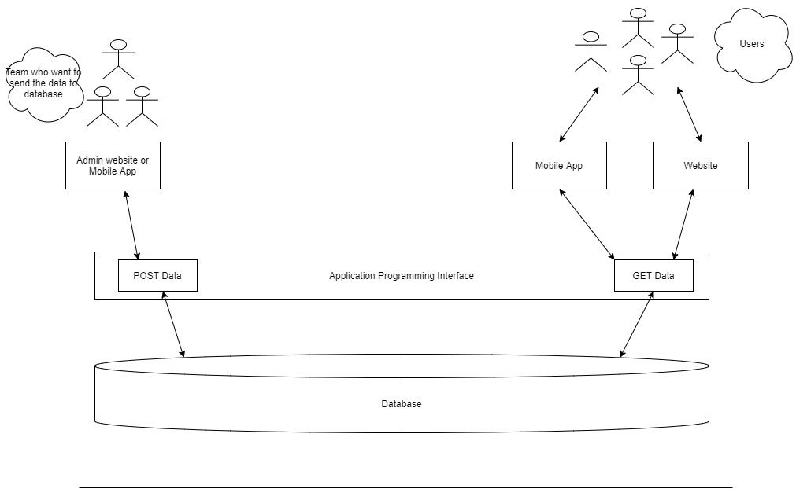

<h1> Introduction to APIs</h1>
In simple words -  
Let's say we have an URL / Function / Package which receives some data and returns  data accordingly, we can call it an **API (Application Programming Interface)**
 
 

**Example 1** -
  You've installed speech-recognition package in your program and in that package there is a function which receives audio as input and returns you the text recognized from your audio file. That package is acting as an API. 

**Example 2** -
In google search bar you give some inputs or search query and it returns you the results accordingly, so google is using an API to receive search parameters and returns you the result based on those parameters. 

 
Let's make it more clear -

You're a developer and working in a firm related to weather forcasting and there is a team which collects all the data related to weather. Now they need a way to store that data into database and also share with the world via a mobile app or a website. 

Now you as a developer will provide them an endpoint (an URL) which accepts the data (let's say, that data contains a date and the temprature) and store that data into database. So other developers who will design the front-end (Mobile app, Website) will use that endpoint to store the data into database. In the end, that team can use the website or mobile app to store that data. 

Now to share that data with the world, you'll create another endpoint that will accept a date and will return the temprature fetched from the database on that particular date.
Again the mobile app and web developers will use that end-point to fetch the data and show it on their app where the world can see that data.

  
<h2> What kind of data we can pass to an API- </h2>

<h2> Difference between an API and REST API

<h2>

