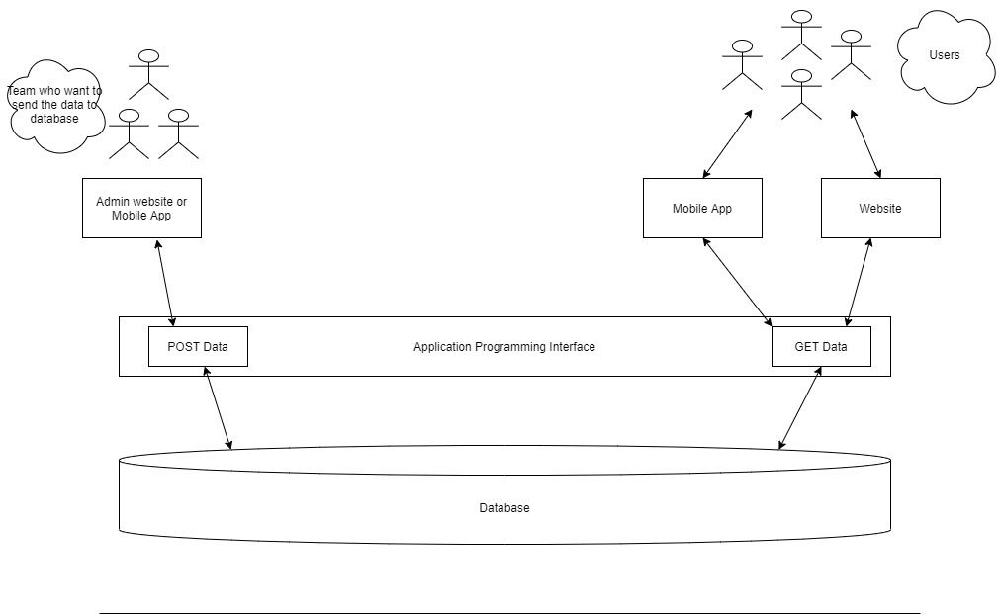

<h1> Introduction to APIs</h1>
In simple words -  
Let's say we have an URL / Function / Package which receives some data and returns  data accordingly, we can call it an **API (Application Programming Interface)**
 
 

**Example 1** -
  You've installed speech-recognition package in your program and in that package there is a function which receives audio as input and returns you the text recognized from your audio file. That package is acting as an API. 

**Example 2** -
In google search bar you give some inputs or search query and it returns you the results accordingly, so google is using an API to receive search parameters and returns you the result based on those parameters. 

 
Let's make it more clear -

You're a developer and working in a firm related to weather forcasting and there is a team which collects all the data related to weather. Now they need a way to store that data into database and also share with the world via a mobile app or a website. 

Now you as a developer will provide them an endpoint (an URL) which accepts the data (let's say, that data contains a date and the temprature) and store that data into database. So other developers who will design the front-end (Mobile app, Website) will use that endpoint to store the data into database. In the end, that team can use the website or mobile app to store that data. 

Now to share that data with the world, you'll create another endpoint that will accept a date and will return the temprature fetched from the database on that particular date.
Again the mobile app and web developers will use that end-point to fetch the data and show it on their app where the world can see that data.

  

<h2> Difference between an API and REST API- </h2>
While an API is a set of functions / procedures that allows a developer to share the features of an application with another in the way of packages/URL/functions/applications. 
But on other hand Rest APIs are more limited, It follows some rules and guidelines for applications on the web (HTTP). There are alot of other ways to build a web API, but REST is more effiecient and standard way of doing it which makes it easy for other developers or third parties to understand the functionality of an API very easily. 
Unlike common APIs, we don't need to install anything software, libraries or pacakges to use those APIs. 
Using REST APIs, one can return the data in the form of JSON, XML, YAML and others.

<h3> 6 Principles that make an API a REST API</h3>

1. <b>Uniform Interface -</b>   APIs should follow a common interface, if a developer knows how to use one of your API, he should be able to work with other API of yours related to that resource without looking into the documentation.

2. <b>Client-Server -</b>  There should be no dependency between Client and Server, they should only communicate through the provided URI. 

3. <b> Stateless -</b>  No information stored in between, No history, No session. Each request will be treated as  new request. Authentication or Authorization details will only be passed in the request itself. 

4. <b>Cacheable (When possible)</b> -  Improves the speed by storing cache. It can be implemented on both sides (Client or Server)

5. <b>Layered System -</b>  <i>(from wikipedia)</i> A client can't ordinarily tell whether it is connected directly to the end server or to an intermediary along the way.  

6. <b> Code on Demand (Optional) -</b>  You can also send the code while calling an API to render the widgets dynamically.  

For more about REST APIs -  https://en.wikipedia.org/wiki/Representational_state_transfer